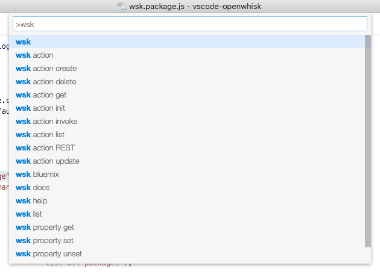

# VSCode OpenWhisk Extension

This is a prototype extension for Visual Studio Code https://code.visualstudio.com/ that enables complete round trip cycles for authoring OpenWhisk actions inside the editor.  The key point for this extension is that it has full round trip for open whisk actions (list, create new local, create new remote, update, import from remote system, invoke, etc…) without ever leaving the IDE and makes dev cycles far shorter and easier.  It also works for both Swift and JS actions on Windows, Mac, and Linux. 

Download and run the installer for your platform from the [Downloads Section](#downloads).

 

Preview of VS Code OpenWhisk extension here:

https://youtu.be/aPsLXvphkro

##
Downloads
=========
**Latest stable:** Download the packaged extension from the [releases page.](https://github.com/openwhisk/vscode-openwhisk/releases)

To install download the extension and drag it into VSCode

## Usage

OpenWhisk command can be invoked from the Command Palette using the prefix `wsk`.  You can invoke the Command Palette by pressing `F1` or by using the key combination `CMD Shift P` (OS X, there is an equivalent for Windows/Linux).

## Configuration

Once you have the extension installed, you will have to run `wsk property set` inside of VS Code to set the auth and namespace values.  These values can be retrieved from either the OpenWhisk CLI using `wsk property get` or from the web interface.

## Util Commands

### `wsk` commands:
     bluemix             launch OpenWhisk console on Bluemix
     docs                open OpenWhisk docs
     property set        set property
     property unset      unset property
     property get        get property
     action              see available commands for OpenWhisk actions

### `wsk action` commands:
     init                create new action boilerplate file
     create              create new action
     sequence            create a new sequence of actions
     update              update an existing action
     invoke              invoke action
     get                 get action
     delete              delete action
     list                list all actions
     rest                display CURL rest invocation parameters
     
     
